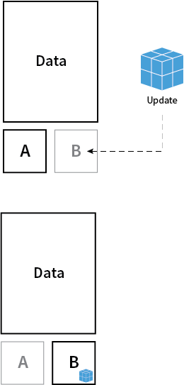
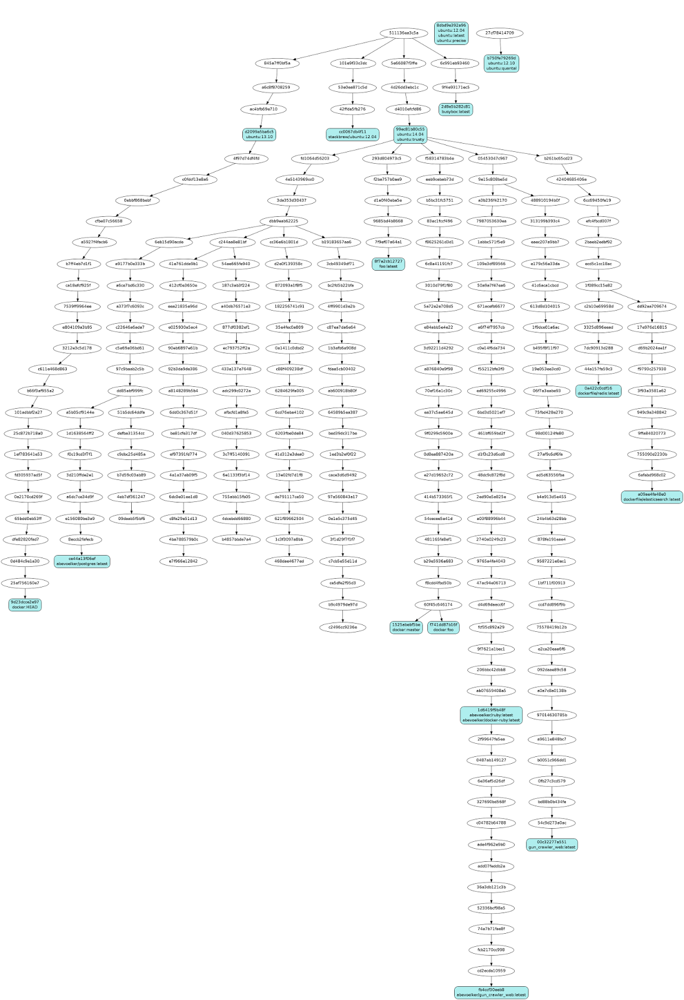

CoreOS and etcd
=========


# Contents  
1. Core OS  
2. etcd
3. References


# Core OS
* Definition
 Docker 구동,안정적으로 Docker를 서포트 하는것에 특화된 리눅스OS

* Characteristics
    - 최소화된 OS : 메모리 적게 사용
    - 빠른 OS 업데이트 (CoreUpdate)
        - OS용으로 2개의 부트 파티션 지님
        - 업데이트 작업을 빠르고 안정적으로 수행

* 

- A파티션에서 동작하는 CoreOS는 B파티션에 동일한 내용 지님
- OS업데이트는 B파티션에서 수행함으로서 현재 운영중인 A파티션의 실행에는 영향이 없음
- 업데이트가 끝나면 리부트 후 바로 업데이트가 적용된 B파티션 OS로 스위칭 되므로 매우 빠르고 안정적인 OS업데이트가 가능
- 만약 업데이트에 문제가 발생했을경우 A파티션이 남아 있으므로 손쉬운 롤백이 가능하다는 장점
- 조작 또한 웹 콘솔상에서 원격 제어가 가능하다. CoreUpdate는 상용 서포트에서만 사용가능한 기능


# etcd
* Definition
- go언어와 Raft프레임워크 이용해 작성된 오픈소스 key-value 저장소
- Core OS 에서 개발한 신뢰할수 있는 분산 Key-Value Store 정도로 볼수 있다.
- 대규모 Docker 클러스터링에 있어서 컨테이너들을 유기적으로 연동시키고 억세스하기 위한 세련된 아키텍처를 제공

* 

- OS에 배당된 IP 어드레스에 비해 탑재된 컨테이너들의 수는 엄청나게 많음
- 이러한 컨테이너들에 접근하기 위해서는 IP 어드레스 이외의 효율적인 어드레싱 수단 필요
- etcd는 이러한 어드레싱을 HTTP/JSON을 이용해 구현


# References
1. Docker 전용 경량 리눅스 - CoreOS
 https://www.moreagile.net/2014/07/docker-coreos.html?showComment=1578627653242#c7589819222755520368

2. Etcd 란?
 https://anywon.tistory.com/9

``` ```