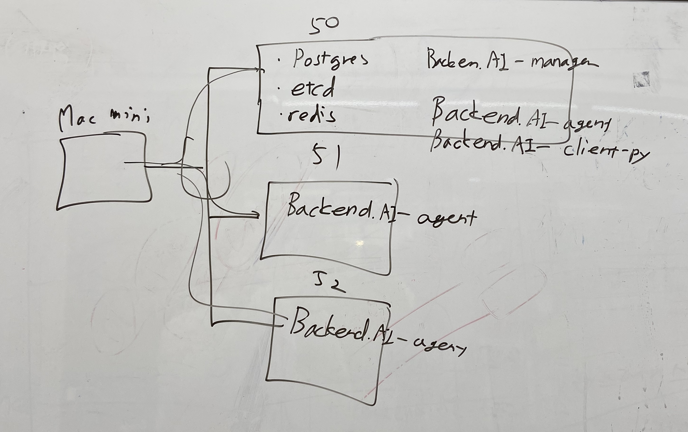

Set up backend.ai servers
=========

내 맥미니 가상머신에 backend.ai 서버 구축하기
---------


# Contents  
1. Process
2. image
3. References

# Process
1. 내 맥미니에 가상서버 구축 (magent1, agent2, agent3)
vagrant로 가상머신 만듦

2. backend.ai 설치
    1. 저번에 pyenv로 만든 ansible1 환경이 깔린 디렉토리 접속(ansible)
    2. 앤서블로 설치
    ```ansible-playbook -i [INVENTORY_FILE PATH/TO/INSTALL/ANSIBLE/File.yaml] [playbook_file_to_install] -K -e "operation=install"```
    ```ansible-playbook -i targets1909.yaml   scripts/install_backend_ai_rolebased2.yaml -K -e "operation=install"```


3. 가상머신 접속
vagrant ssh magent1

4. 맥미니 키를 가상머신에 추가
* 이유 : 이 가상머신은 vagrant로 만들어졌기 때문에 vagrant만 접속가능  
* 해결 : .ssh 의 authrozied keys에 내 public key 추가
* 결과  
```ssh vagrant@10.100.64.50```
맥미니에서 접속 가능

5. 매니저 서버 접속 
```ssh vagrant@10.100.64.50``` 
```backend.ai run lablup/python:3.6-ubuntu18.04    -c "print('hello')"```

6. client 폴더에 python 3.8.0 설치
python 3.8.0 설치(pyenv)

7. backend.ai-console-server 설치
> https://github.com/lablup/backend.ai-console-server

8. 사용
* console-server/ 디렉토리 접속
    * 이 디렉토리에 pyenv로 만들어진 파이썬 가상환경이 있기 때문  
    `venv-pycon2019-console-server`
    * 어느 디렉토리에서나 이 가상환경을 적용하고 싶으면  
    `pyenv global venv-pycon2019-console-server`
* 웹 서버 open
```python -m ai.backend.console.server```
* 웹 서버 주소 
http://10.100.64.50:8080/


9. 아직 못한 부분
* ws proxy 설치
* 그래서 아직 세션은 실행할 수 없음

# Image



# References
jsyang
