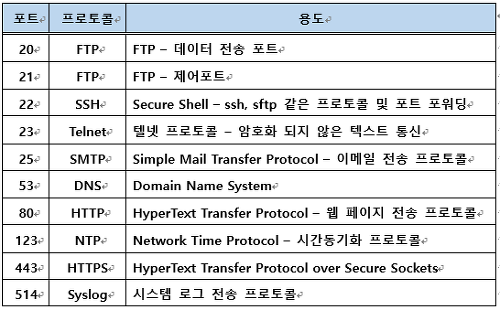

Port
=========

# Contents  
1. Definition 
2. IP&port
3. Well-known port
4. Example
5. Further 
6. References

# Definition
1. H/W
    운영 체제 통신의 종단점
2. S/W
    네트워크 서비스나 특정 프로세스를 식별하는 논리 단위

# IP&port
* 둘을 이용하여 특정 컴퓨터의 프로그램을 이용할 수 있음
    - IP address : 컴퓨터를 찾을 때 필요한 주소
    - Port : 컴퓨터 안에서 프로그램을 찾을 때를 나타내는 것
* Use (URI 문법)
    - ftp://000.000.000.000:21
    - 000.000.000.000은 IP 주소
    - 21이 포트 번호

# Type
* 포트 수 : 0번 ~ 65535번
* 종류
    1. Well-known port, 잘 알려진 포트 : 0번 ~ 1023번
    2. registered port, 등록된 포트 : 1024번 ~ 49151번
    3. dynamic port, 동적 포트 : 49152번 ~ 65535번 

# Well-known port
특정한 쓰임새를 위해서 할당한 TCP, UDP 포트 번호로 이루어짐

# Example
* Web
    www.naver.com:80
    으로 접속하면 되는데 다른 숫자는 안됨
* ssh
    ssh -p 22 abc@123.45.6.78
    22로만 접속

# Further
* TCP, UDP
> 주로 포트를 사용하는 프로토콜은 전송 계층 프로토콜입니다.
> 그래서 포트 또한 전송 제어 프로토콜(TCP)와 사용자 데이터그램 프로토콜(UDP)이 관리한답니다!

# References
[포트[PORT]에 대하여]  
https://run-it.tistory.com/19

[생활코딩 동영상]  
https://opentutorials.org/course/2598/14470
